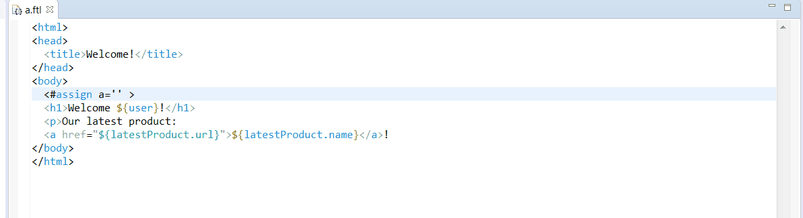

Eclipse Freemarker LSP
===========================

The `LSP4e Freemarker` is a an Eclipse plugin for [Freemarker](https://freemarker.apache.org/) based on:

* [Eclipse LSP4E](https://projects.eclipse.org/projects/technology.lsp4e) to consume the [Freemarker Language Server](https://github.com/angelozerr/freemarker-languageserver) inside Eclipse.
* [Eclipse TM4E](https://projects.eclipse.org/projects/technology.tm4e) to support Freemarker syntax coloration based on TextMate grammar. 
* [Freemarker Language Server](https://github.com/angelozerr/freemarker-languageserver) the freemarker Language Server.

Eclipse BlueSky
===========================

HTML syntax coloration (managed with TextMate) and HTML completion, mark occurrences, etc is not a part of this plugin. I suggest you that you install https://github.com/mickaelistria/eclipse-bluesky
which provides those features.

Demo
===========================

Here a demo (with installed[Eclipse BlueSky](https://github.com/mickaelistria/eclipse-bluesky)):
 
 
 
Build
===========================

See cloudbees job: https://opensagres.ci.cloudbees.com/job/lsp4e-freemarker/