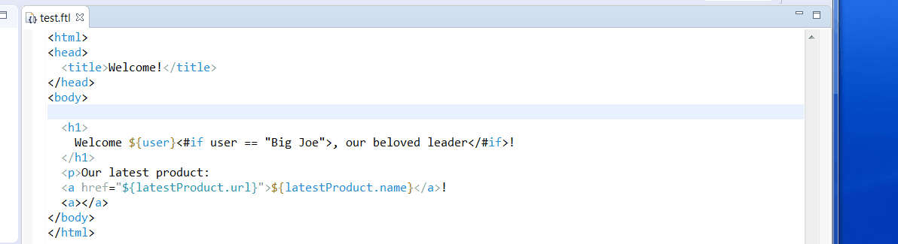

Eclipse FreeMarker LSP
===========================

The `LSP4e FreeMarker` is a an Eclipse plugin for [FreeMarker](https://freemarker.apache.org/) based on:

* [Eclipse LSP4E](https://projects.eclipse.org/projects/technology.lsp4e) to consume the [FreeMarker Language Server](https://github.com/angelozerr/freemarker-languageserver) inside Eclipse.
* [Eclipse TM4E](https://projects.eclipse.org/projects/technology.tm4e) to support FreeMarker syntax coloration based on TextMate grammar. 
* [FreeMarker Language Server](https://github.com/angelozerr/freemarker-languageserver) the FreeMarker Language Server.

Features
===========================

* Syntax coloration for HTML & FreeMarker syntax both
* FreeMarker Validation (as you type) 
 
Demo
===========================

Here a demo (with installed[Eclipse BlueSky](https://github.com/mickaelistria/eclipse-bluesky)):
 
 
 
Installation
===========================

 * Update Site: http://oss.opensagres.fr/lsp4e-freemarker/snapshot/

Note: installation test was done with [Eclipse Photon M6](https://www.eclipse.org/downloads/packages/release/Photon/M6).

Build
===========================

See cloudbees job: https://opensagres.ci.cloudbees.com/job/lsp4e-freemarker/

Eclipse BlueSky
===========================

Once https://github.com/mickaelistria/eclipse-bluesky/issues/63 will work in Photo you could install it.

HTML syntax coloration (managed with TextMate) and HTML completion, mark occurrences, etc is not a part of this plugin. I suggest you that you install https://github.com/mickaelistria/eclipse-bluesky
which provides those features.

Development in Eclipse
======================

1. Use "Eclipse for Committers" (Photon M6 as of this writing).

2. In Eclipse, "File" / "Import..." / "Existing Maven Projects". Point at the `lsp4e-freemarker` project root directory, add all the Maven projects it finds.

3. Now go to "Window" / "Preferences" / "Plug-in Development" / "Target Platform", and Select "lsp4-freemarker" (this only appears if you have imported the "target-platform" Maven project earlier)

TODO: Even after doing point 3., Eclipse can't resolve the "org.eclipse.jdt.launching" bundle.
